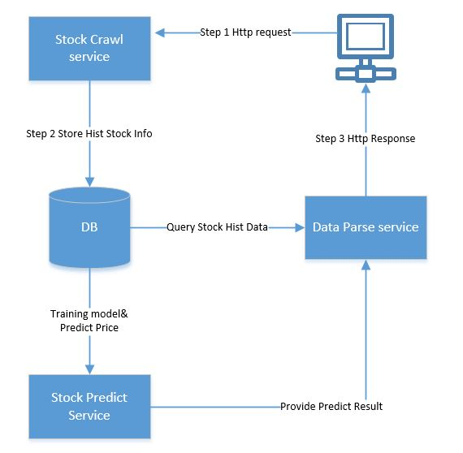
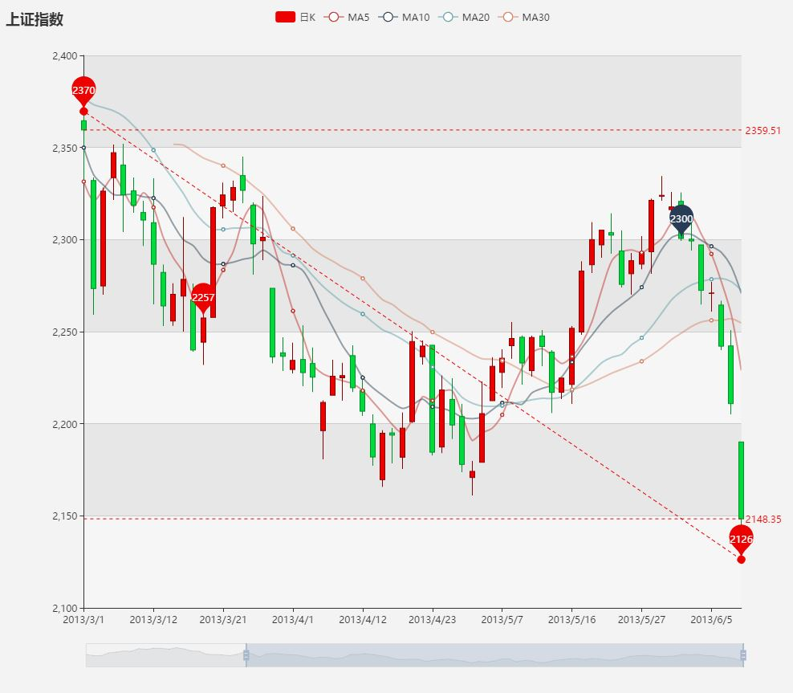
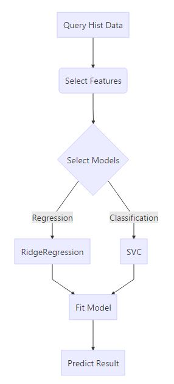

# Stock-price-analysis-service

**Overview:**

- Crawl stock history price info(e.g. close-price,volume,amount) with API
- Deal with stock data and store in database
- Visualize stock data with front end technology
- Use machine learning model to train and predict future stock price trend

## Requirements

* Python 2.7x
* Django
* Mysql-7.0
* sklearn

## Main Use Cases
#### 1. Crawl Stock Hist Price Information
use python to crawl some stock information(fields：open,close,volume) in a period of time

#### 2. Visualize Stock Information
display stock history price trend in html page with crawled data

#### 3. Predict  Tomorrow Stock Price
the predict service train the stock model with the history data,and may predict tomorrow close price with the model 

## Design  Diagram


## Detail  Design
#### 1. Stock Crawl Service
* use Django to make a python-web application
1. the index page is a html template (user can input stock_id,start_time,end_time).
* use python tushare api to crawl stock history price
1. use tushare.get_h_data() method to get stock history price
* define the stock history info  model

Field | Type | Key|Null
---|---|---|---
id       | int(11)    | PRI|NO
stock_id | varchar(6) | NUL|NO
pub_date | varchar(10)|    |NO
close    | double     |    |YES
open     | double     |    |YES
vol      | bigint(20) |    |YES
ma5      | double     |    |YES
ma10     | double     |    |YES

* db use mysql to store stock history info
1. use django model save() method to store data in mysql db
``` python
# crawl stock data with tushare api
df = ts.bar(name, conn=cons, freq='D', start_date=start, ma=[5, 10, 20],factors=['vr', 'tor'])
    for ix,row in df.iterrows():
        stockItem = []
        stock_id= name
        open    = row['open']
        close   = row['close']
        high    = row['high']
        low     = row['low']
        vol     = row['vol']
        amount  = row['amount']
        tor     = row['tor']
        vr      = row['vr']
        ma5     = row['ma5']
        ma10    = row['ma10']
        ma20    = row['ma20']
        stock = Stock(stock_id=stock_id,open=open,close=close,high=high,amoun=amount,vol=vol,low=low,pub_date=ix,tor=tor, vr=vr, ma5=ma5, ma10=ma10, ma20=ma20)
        stock.save()
```

#### 2. Data Parse Serivice
* use django model to query stock info in mysql db
1. use  model filter method to query stock history info from db
``` python 
result = Stock.objects.filter(stock_id=name).filter(pub_date__range=(start,end))
```
* visualize stock history info with echarts. 
1. echarts is a open sourced js lib with baidu
2. include echarts js in html template and send the stock data
```
<head>
    <!-- 引入 echarts.js -->
    <script src="../static/javascript/echarts.js"></script>
</head>
```
``` python
#send data to html template
return render_to_response('kline.html',{'data0':data0})
```
3. echarts can display the stock data in a k-line


#### 3. Stock Predict Serivice
* training predict model
```
graph TD
A[Query Hist Data]-->B(Select Features)
B(Select Features)-->C{Select Models}
C-->|Regression|D[RidgeRegression]
C-->|Classification|E[SVC]
D-->F[Fit Model]
E-->F[Fit Model]
F-->G[Predict Result]
```

1. select features
   1. hl_pct = (high-low)/low*100.0
   2. ma5_ma10_pct = ma5/ma10*100.0
   3. vol
2. select models
   1. ridgeRegression(predict value)
   2. svc(classification)
3. fit model
   1. 70% data for training
   2. 30% data for test
   3. save 2 models for predict

``` python
clf = Ridge()
x_train,x_test,y_train,y_test = train_test_split(x,y,test_size=0.3)
clf.fit(x_train,y_train)
clf.score(x_test,y_test)
joblib.dump(clf,"ridge_clf.pkl")
```
4. evaluate model effect
   1. model.score()
   2. MSE
``` python
y_test_predicts = clf.predict(x_test)
mse = sum((y_test-y_test_predicts)**2)
mse /=  len(y_test_predicts)
print 'mse: ',mse
print 'score: ',clf.score(x_test,y_test)
```

* predict the tomorrow close price
1. generated today features
2. call predict method to get tomorrow price
``` python
#load price model
clf   = joblib.load("models/val_"+name+"_clf.pkl")
close = clf.predict(today_info)
#load trend model
clf = joblib.load("models/cond_"+name+"_clf.pkl")
cond = clf.predict(today_info)
```
## Future  Work
- crawl data may change to scripy for crawling more stock hist info fields
- select and generate more features for training models
- compare different models predict result,choose the better one
- Now the crawl service and predict service is online,may change them to offline service,especially  we can use
a timed task to crawl data every day